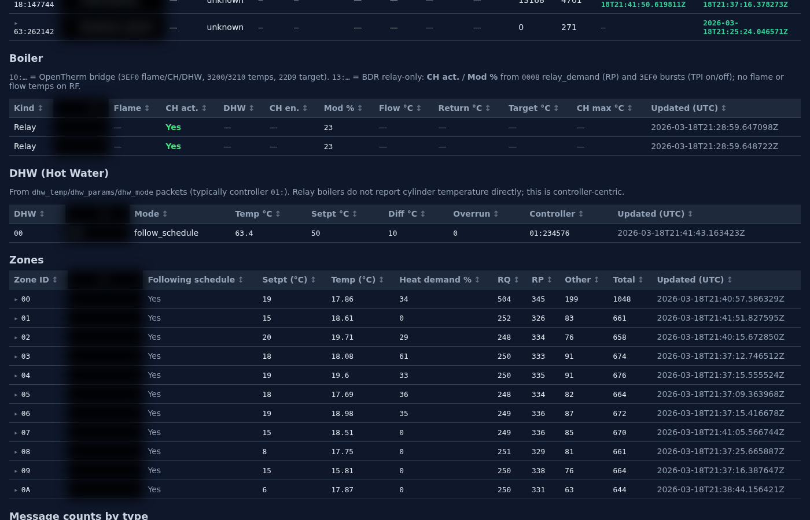
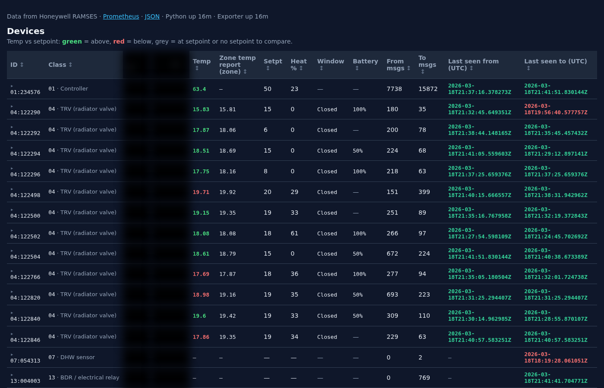

# Honeywell Radio Exporter

## Disclosure

Vibe coded hot mess, done to help me debug why all my HR91 decided to drop off the system. No warranty, no guarantees.

## Description

Multithreaded monitor for Honeywell RAMSES RF:
USB watcher → queue → MySQL consumer (with retention janitor) → Prometheus metrics + web UI/API backed by the database.

> Note: This repo has seen a lot of “workflow experiments”. Behavior can evolve as features are refactored. If something looks surprising, check the latest docs under `docs/`.

## What you get

1. Persistent storage in MySQL (`messages`, `devices`, `zones`, etc.) with versioned schema migrations (`db_migration.py`).
2. Prometheus endpoint: `GET /metrics`
3. Web UI: `GET /ui/`
4. JSON API: `GET /api/devices`
5. Live events SSE: `GET /api/events`

## Prerequisites

- Python `>= 3.11`
- A working RAMSES RF gateway USB device (HGI80 or ESP32/evofw3) accessible on your host
- The `ramses_rf` Python package available at `/home/simon/src/3rd-party/ramses_rf` (or set `RAMSES_RF_PATH`)
- MySQL reachable from this host

## MySQL credentials

Create a file named `.mysql_creds` in the project root (this file is intended to be gitignored), e.g.:

```text
host=127.0.0.1
port=3306
user=myuser
password=secret
database=honeywell_rf
```

The app will create the database (if missing) and apply migrations on startup.

## Install (development)

```bash
cd /home/simon/src/development/honeywell-radio-exporter
python3 -m venv .venv
source .venv/bin/activate

pip install -e .
# Optional, for lint/test tooling:
pip install -e ".[dev]" || true
```

## Quick start (run against real RF hardware)

```bash
source .venv/bin/activate

# Start watcher + consumer + HTTP server
python -m honeywell_radio_exporter --ramses-port /dev/ttyACM0

# Optional: change HTTP port
python -m honeywell_radio_exporter --ramses-port /dev/ttyACM0 --port 8000

# Optional: extra logs
python -m honeywell_radio_exporter --ramses-port /dev/ttyACM0 --log-level DEBUG
```

If you want to run without attaching the USB watcher (DB consumer still runs):

```bash
python -m honeywell_radio_exporter --no-device
```

## Command line options

```text
--port PORT              HTTP port (default: 8000): /ui/, /metrics/, /api/devices
--host ADDR              Bind address (default: 0.0.0.0 = all interfaces)
--ramses-port DEVICE     RAMSES RF serial device (default: /dev/ttyACM0)
--gateway-type auto|hgi80|evofw3
--no-device              Do not start USB watcher
--log-level LEVEL        DEBUG, INFO, WARNING, ERROR (default: INFO)
```

For the full “how to run” guide, see `docs/USAGE.md`.

## UI and API

When the exporter is running:

- UI: `http://localhost:8000/ui/`
- API: `http://localhost:8000/api/devices`
- Metrics: `http://localhost:8000/metrics/`
- Events (SSE): `http://localhost:8000/api/events`

The `zones` and `devices` tables in the UI are backed by MySQL and updated as messages arrive.

## UI screenshots (censored)

These screenshots were taken from `GET /ui/` and **name-bearing columns were blurred** so you can publish them safely.

### Zones



### Devices



## Docker

See `docs/README.docker.md`.

## Systemd service

See `docs/ramses-prometheus-exporter.service`.

## Development workflow

For fast “edit → restart” cycles:

```bash
./scripts/dev.sh --ramses-port /dev/ttyACM0 --port 8000
```

`dev.sh` watches for file changes and restarts the exporter. If you see `OSError: [Errno 98] Address already in use`, the script will proactively kill anything bound to the selected `--port` before starting again.

## Tests and quality checks

The repo uses `tox`:

```bash
tox -e format
tox -e format-check
tox -e lint
tox -e test-no-cov
```

Or run tests directly:

```bash
pytest tests/ -v
```

## Documentation index

- `docs/USAGE.md` (runbook / CLI options / troubleshooting)
- `docs/CACHE_DOCUMENTATION.md` (zone/device name caching)
- `docs/DASHBOARD_UPDATES.md` (Grafana dashboard changes)
- `docs/ZONE_DEVICE_MAPPING.md` and `docs/ZONE_DEVICE_MAPPING_CHANGELOG.md`
- `docs/README.docker.md`
- `docs/SUMMARY.md`
- `docs/scripts/README.md` (Grafana dashboard uploader helper)

# Warning

______________________________________________________________________

Heavy use of vibe coding involved, this project is mostly me testing workflows around AI more than
actually delivering working code. YMMV, no warranties, not reviewed, past results do not guarantee
future results, contact a doctor if it lasts longer than 4 hours.

______________________________________________________________________

# Honeywell Radio Exporter

Multithreaded monitor for Honeywell RAMSES RF: USB watcher → queue → MySQL consumer, janitor for
retention, Prometheus + web UI backed by the database.

## Features

- **Watcher thread**: `ramses_rf` gateway, internal queue, raw rotating logs under `logs/raw_messages/`
- **Consumer thread**: validates messages, persists to MySQL (`messages`, `devices`, `zones`, `message_code_counts`, `fault_log_entries`, `puzzle_version_events`, `boiler_status` for OpenTherm `10:` gateways)
- **Janitor**: drops messages older than 24h, devices unseen for 4 weeks
- **`db_migration.py`**: versioned schema on startup (see `schema_migrations`)
- **Prometheus**: `/metrics/` — gauges refreshed from DB on each scrape
- **Web UI**: `/` → `/ui/` — zones table, message-type counts, devices; `/api/devices` JSON (includes `zones`, `message_code_counts`)
- **Legacy**: `ramses_prometheus_exporter.py` remains for reference; entrypoint is `honeywell_radio_exporter.app:main`

## MySQL credentials

Create **`.mysql_creds`** in the project root (gitignored), one key per line:

```text
host=127.0.0.1
port=3306
user=myuser
password=secret
database=honeywell_rf
```

The app creates the database if needed and applies migrations on startup.

## Logs

- `logs/messages.log` — application / validation logging (10MB × 5). On each start, the previous file is rotated to `messages.log.1` (unless `LOG_ROTATE_ON_START=0`).
- `logs/raw_messages/raw_messages.log` — one line per bus message (100MB × 5); **no** startup rotation (append); still rotates by size when full.

## Installation

### Prerequisites

- Python 3.11 or higher
- A USB-to-RF device (Honeywell HGI80 or ESP32 with evofw3 firmware)
- The `ramses_rf` module available at `/home/simon/src/3rd-party/ramses_rf`
- For a **Honeywell HGI80** on `/dev/ttyACM0`, use **`--gateway-type hgi80`** (or **`RAMSES_GATEWAY_TYPE=hgi80`**) if you see “gateway type is not determinable” — otherwise ramses_rf assumes evofw3.

### Development Setup

1. **Clone and navigate to the project**:

   ```bash
   cd /home/simon/src/development/honeywell-radio-exporter
   ```

1. **Install dependencies**:

   ```bash
   pip install -e .
   pip install -e ".[dev]"
   ```

1. **Install the ramses_rf module**:

   ```bash
   cd /home/simon/src/3rd-party/ramses_rf
   pip install -e .
   ```

## Testing

Use **tox** (includes **black** via `tox -e format` / `format-check`).

MySQL integration tests (`tests/test_db_migration.py`) are skipped unless you set e.g.
`MYSQL_TEST_HOST=127.0.0.1` and optional `MYSQL_TEST_USER`, `MYSQL_TEST_PASSWORD`,
`MYSQL_TEST_DATABASE` (default `honeywell_exporter_test`).

Legacy tests that targeted the old monolithic exporter are skipped by default.

```bash
tox -e format          # apply black (line length 100)
tox -e format-check
tox -e test-no-cov     # pytest
tox -e lint
```

### Running Tests Manually

```bash
# Run unit tests
pytest tests/ -v

# Run with coverage
pytest tests/ --cov=honeywell_radio_exporter --cov-report=html

# Run linting
pylint honeywell_radio_exporter/
flake8 honeywell_radio_exporter/
black --check honeywell_radio_exporter/
isort --check-only honeywell_radio_exporter/

# Run type checking
mypy honeywell_radio_exporter/

# Run security checks
bandit -r honeywell_radio_exporter/
```

### Using the Test Runner

For convenience, use the included test runner:

```bash
python run_tests.py
```

This will run all tests and provide a summary of results.

## Code Quality Tools

The project includes several code quality tools:

- **pytest**: Unit testing framework
- **pylint**: Code analysis and style checking
- **flake8**: Style guide enforcement
- **black**: Code formatting
- **isort**: Import sorting
- **mypy**: Static type checking
- **bandit**: Security vulnerability scanning
- **coverage**: Code coverage reporting

## Usage

### Basic Usage

```bash
# Start with RAMSES RF device
python -m honeywell_radio_exporter --ramses-port /dev/ttyUSB0

# Start with custom port
python -m honeywell_radio_exporter --ramses-port /dev/ttyUSB0 --port 9090

# Start with debug logging
python -m honeywell_radio_exporter --ramses-port /dev/ttyUSB0 --log-level DEBUG

# Alternative: using the installed script
honeywell-radio-exporter --ramses-port /dev/ttyUSB0
```

### As a Service

```bash
# Install the service
sudo cp honeywell_radio_exporter/ramses-prometheus-exporter.service /etc/systemd/system/
sudo systemctl daemon-reload
sudo systemctl enable ramses-prometheus-exporter

# Start the service
sudo systemctl start ramses-prometheus-exporter

# Check status
sudo systemctl status ramses-prometheus-exporter
```

## Configuration

### Prometheus Configuration

Add to your `prometheus.yml`:

```yaml
scrape_configs:
  - job_name: 'honeywell-radio-exporter'
    static_configs:
      - targets: ['localhost:8000']
    scrape_interval: 10s
    metrics_path: /metrics
```

## Available Metrics

- `ramses_messages_total`: Total number of RAMSES messages received
- `ramses_message_types_total`: Total number of messages by type
- `ramses_device_communications_total`: Total number of communications between devices
- `ramses_active_devices`: Number of active devices in the system
- `ramses_last_message_timestamp`: Timestamp of the last message received
- `ramses_message_rate`: Messages per second over the last minute
- `ramses_message_processing_duration_seconds`: Time spent processing messages
- `ramses_message_errors_total`: Total number of message processing errors
- `ramses_message_payload_size_bytes`: Size of message payloads
- `ramses_device_temperature_celsius`: Temperature reading per device in Celsius
- `ramses_device_setpoint_celsius`: Target temperature setpoint per device/zone
- `ramses_device_info`: Device information (ID to name mapping)
- `ramses_device_last_seen_timestamp`: Last message timestamp per device
- `ramses_zone_info`: Zone information (zone index to zone name mapping)
- `ramses_zone_window_open`: Window open state per zone (0=closed, 1=open)
- `ramses_zone_mode_info`: Zone operating mode information
- `ramses_heat_demand`: Heat demand per zone (0.0-1.0 = 0-100%)
- `ramses_system_sync_remaining_seconds`: Seconds until next system sync
- `ramses_system_sync_last_timestamp`: Last system sync message timestamp
- `ramses_boiler_messages_sent_total`: Total messages sent to boilers
- `ramses_boiler_messages_received_total`: Total messages received from boilers
- `ramses_boiler_last_seen_timestamp`: Last message from boiler
- `ramses_boiler_last_contacted_timestamp`: Last message sent to boiler
- `ramses_boiler_setpoint_celsius`: Current boiler setpoint temperature
- `ramses_boiler_modulation_level`: Current boiler modulation level (0.0-1.0)
- `ramses_boiler_flame_active`: Boiler flame status (0=off, 1=on)
- `ramses_boiler_ch_active`: Central heating active status (0=off, 1=on)
- `ramses_boiler_dhw_active`: Domestic hot water active status (0=off, 1=on)
- `ramses_system_info`: Information about the RAMSES RF system

## Development

### Project Structure

```
honeywell-radio-exporter/
├── honeywell_radio_exporter/          # Main package
│   ├── __init__.py
│   ├── ramses_prometheus_exporter.py
│   └── requirements.txt
├── tests/                       # Test files
│   └── test_exporter.py
├── tox.ini                      # Tox configuration
├── pyproject.toml              # Project configuration
├── .pylintrc                   # Pylint configuration
├── run_tests.py                # Test runner script
└── README.md                   # This file
```

### Adding New Tests

1. Create test functions in `tests/test_exporter.py`
1. Use pytest fixtures and markers as needed
1. Run tests with `pytest tests/ -v`

### Code Style

The project follows PEP 8 with some modifications:

- Line length: 88 characters (Black default)
- Use Black for formatting
- Use isort for import sorting
- Follow pylint recommendations

### Pre-commit Hooks

Consider setting up pre-commit hooks for automatic code quality checks:

```bash
pip install pre-commit
pre-commit install
```

## Troubleshooting

### Common Issues

1. **Import errors**: Ensure the `ramses_rf` module is properly installed
1. **Permission errors**: Check USB device permissions
1. **Test failures**: Run `tox -e py311` to see detailed error messages

### Debug Mode

Run with debug logging for detailed information:

```bash
python -m honeywell_radio_exporter --ramses-port /dev/ttyUSB0 --log-level DEBUG
```

## Contributing

1. Fork the repository
1. Create a feature branch
1. Make your changes
1. Run tests: `python run_tests.py`
1. Submit a pull request

## License

This project is licensed under the MIT License.
